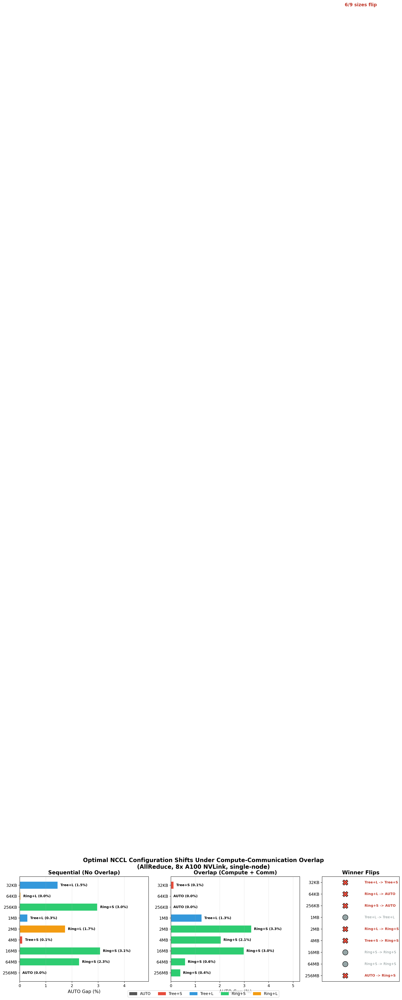
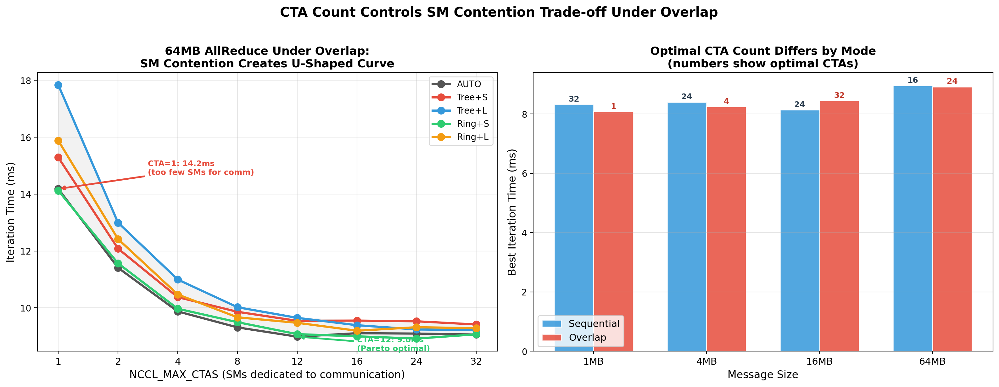
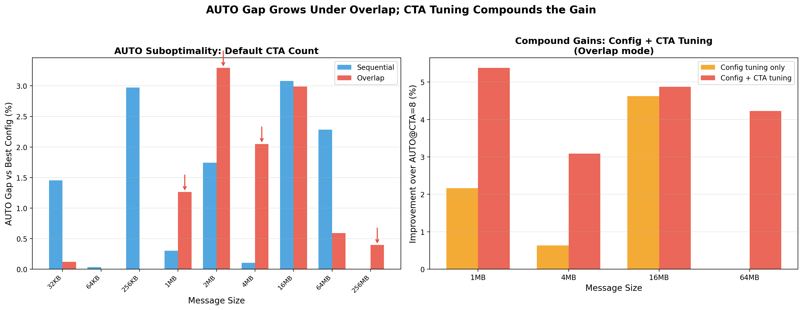
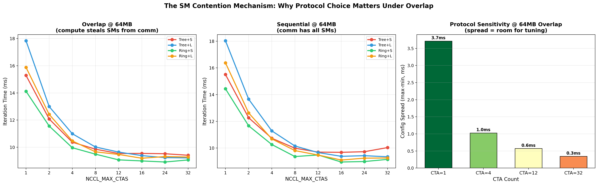
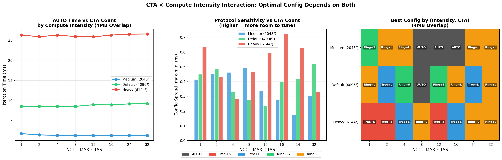

# Workload-Aware Tuning of NCCL Collectives on Multi-GPU Systems

## Problem

NCCL's AUTO mode selects collective algorithms (Tree, Ring) and protocols (LL, LL128, Simple) using a static cost model calibrated for **isolated** collectives. In real training, collectives overlap with compute on concurrent CUDA streams. Nobody has studied whether this overlap changes the optimal selection.

## Key Finding

**It does.** On 8x A100 NVLink, 6 out of 9 message sizes change their optimal NCCL configuration when switching from sequential to overlapped execution. NCCL AUTO cannot adapt because it has no visibility into concurrent compute.

## Setup

- **Hardware**: 8x NVIDIA A100-SXM4-80GB, NVLink, single-node
- **Collective**: AllReduce (fp32)
- **Workload**: Simulated training iteration — matmul (compute) + AllReduce (communication)
- **Overlap**: Compute and AllReduce on separate CUDA streams
- **Configs tested**: AUTO, Tree+Simple, Tree+LL128, Ring+Simple, Ring+LL128
- **Measurement**: 50 iterations, 10 warmup, median reported

## Results

### 1. Winner flips under overlap (Fig 1)

| Size | Sequential Best | Overlap Best | Flip? |
|------|----------------|-------------|-------|
| 32KB | Tree+LL128 | Tree+Simple | Yes |
| 64KB | Ring+LL128 | AUTO | Yes |
| 256KB | Ring+Simple | AUTO | Yes |
| 1MB | Tree+LL128 | Tree+LL128 | |
| 2MB | Ring+LL128 | Ring+Simple | Yes |
| 4MB | Tree+Simple | Ring+Simple | Yes |
| 16MB | Ring+Simple | Ring+Simple | |
| 64MB | Ring+Simple | Ring+Simple | |
| 256MB | AUTO | Ring+Simple | Yes |

Ring+Simple dominates under overlap for messages >= 2MB because it uses fewer SMs than tree-based or LL128 protocols, leaving more SMs for compute.



### 2. CTA count is an underexplored tuning knob (Fig 2)

NCCL_MAX_CTAS controls how many SMs NCCL dedicates to communication. At 64MB under overlap:

- **CTA=1**: 14.2ms (communication starved, protocols spread by 3.7ms)
- **CTA=12**: 9.0ms (Pareto optimal, protocols converge to 0.6ms spread)
- **CTA=32**: 9.1ms (diminishing returns, compute starts losing SMs)

The optimal CTA count **differs between modes**: overlap prefers fewer CTAs for small messages (CTA=1 at 1MB), sequential prefers more (CTA=32 at 1MB).



### 3. Compound tuning gains (Fig 3)

Config tuning alone: 1-3% over AUTO at default CTA count.
Config + CTA tuning together: **3-5.4%** improvement.

| Size | Config only | Config + CTA | Optimal CTA |
|------|-----------|-------------|------------|
| 1MB | 0.6% | **5.4%** | 1 |
| 4MB | 0.6% | **3.1%** | 4 |
| 16MB | 4.6% | **4.9%** | 32 |
| 64MB | 0.0% | **4.2%** | 24 |



### 4. The mechanism: SM contention (Fig 4)

At low CTA counts, protocols with high SM footprints (Tree+LL128) degrade faster than lightweight ones (Ring+Simple). At CTA=1, Tree+LL128 is 3.7ms slower than Ring+Simple at 64MB. At CTA=12, the gap shrinks to 0.6ms. This explains why overlap shifts the optimal config: compute steals SMs, effectively forcing the system into a low-CTA regime where protocol choice matters.



### 5. Compute intensity modulates the effect (Fig 5)

At 4MB, the optimal CTA count shifts with compute intensity:

| Compute | Optimal CTA | Gain vs AUTO@CTA=8 |
|---------|------------|-------------------|
| Medium (2048x2048) | 8 (any) | 0.0% |
| Default (4096x4096) | 2 | 3.8% |
| Heavy (6144x6144) | 1 | 1.1% |

Light compute: communication dominates, CTA doesn't matter. Default: the sweet spot where SM contention is meaningful. Heavy: compute dominates, nothing matters.



## Artifacts

### Tuner Plugin

`tuner/workload_aware_tuner_plugin.c` — NCCL tuner plugin (v5 API) using a static lookup table derived from our experiments. Set `NCCL_OVERLAP_MODE=1` to activate overlap-aware policy.

```bash
gcc -shared -fPIC -o libnccl_workload_tuner.so workload_aware_tuner_plugin.c -I.
NCCL_TUNER_PLUGIN=./libnccl_workload_tuner.so NCCL_OVERLAP_MODE=1 torchrun ...
```

### Data

- `data/overlap_experiment.json` — Sequential vs overlap, 9 sizes x 5 configs
- `data/channel_experiment.json` — CTA sweep (8 counts x 4 sizes x 5 configs x 2 modes) + CTA x compute interaction
- `data/tuner_policy.json` — Derived policy table

## Limitations

- Single-node NVLink only. Inter-node (RoCE/InfiniBand) expected to show larger effects.
- AllReduce only. Other collectives (AllGather, ReduceScatter) may differ.
- A100 only. H100/B100 have different SM counts and NVLink topologies.
- Gaps are 1-5% for algo/proto tuning. CTA tuning adds another 3-5%. Multi-node would amplify both.

## What's Next

1. **Multi-node experiment** (2x H100 nodes) — `run_modal_multinode.py` is ready, needs H100 access
2. **End-to-end validation** — Run actual GPT-2 training with the tuner plugin vs AUTO
3. **Dynamic detection** — Infer overlap mode at runtime instead of requiring an environment variable
